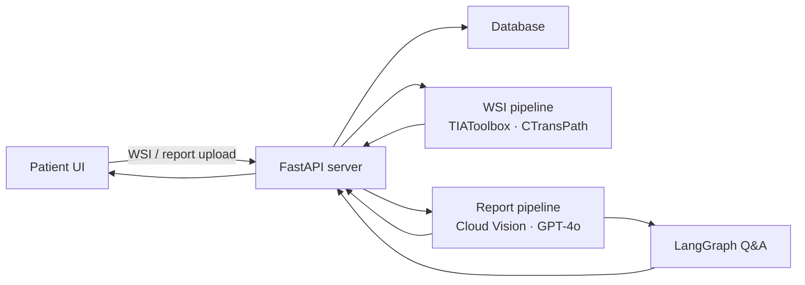
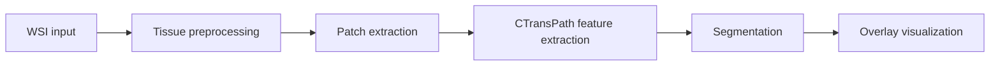
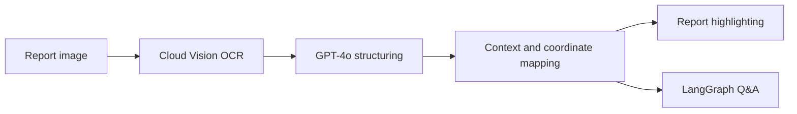

# 환자 중심 디지털 병리 AI 서비스

> WSI(Whole Slide Image) 분석과 병리 결과지 OCR을 결합해, 환자가 병리 결과를 시각적으로 확인하고 쉬운 언어로 이해할 수 있도록 돕는 AI 서비스입니다.

## 프로젝트 개요

병리 결과는 전문 용어와 복잡한 이미지로 구성되어 있어 환자가 자신의 상태를 직접 이해하기 어렵습니다. 이 프로젝트는 의료진의 진단을 대체하는 것이 아니라, 환자가 결과를 보다 쉽게 확인하고 이해할 수 있도록 두 가지 분석 흐름을 하나의 서비스로 통합했습니다.

- **WSI 분석:** 병리 슬라이드에서 관심 조직 영역을 분할하고 결과를 오버레이로 시각화
- **병리 결과지 분석:** OCR로 문서의 텍스트와 좌표를 추출하고, 내용을 구조화해 핵심 영역을 강조
- **환자 중심 설명:** 병리 문맥을 유지하며 이해하기 쉬운 한국어 요약과 질의응답 제공

> **주의:** 본 서비스는 교육·연구 목적의 프로토타입이며 의료진의 진단이나 의학적 판단을 대체하지 않습니다.

## 개발 정보

| 항목 | 내용 |
| --- | --- |
| 개발 기간 | 2025.12.05 - 2025.12.31 |
| 팀 구성 | 6명 (DB 2명, Frontend 2명, Backend 2명) |
| 담당 역할 | Backend |

## 주요 기능

### 1. WSI 분석 및 시각화

- WSI 업로드 및 웹 뷰어 기반 탐색
- 조직 영역 전처리와 타일·패치 생성
- CTransPath 기반 특징 추출 및 조직 영역 분할
- 분석 결과를 원본 슬라이드 위에 오버레이로 표시
- 분할 결과의 투명도 조절과 결과 이미지 저장

### 2. 병리 결과지 OCR 및 구조화

- Google Cloud Vision OCR을 이용한 텍스트·좌표 추출
- GPT-4o를 활용한 비정형 병리 텍스트의 의미 단위 구조화
- 진단명, 육안 소견, 현미경 소견 등 주요 섹션 분류
- 원문과 구조화 결과를 연결한 영역별 하이라이팅

### 3. 환자 맞춤형 설명과 질의응답

- 전문 병리 내용을 환자가 이해하기 쉬운 한국어로 요약
- LangGraph 기반 대화 상태와 문맥 관리
- 환자의 병리 결과를 바탕으로 한 질의응답
- 의료적 오해를 줄이기 위한 가드레일 적용

## 시스템 아키텍처

### WSI 파이프라인

### OCR 파이프라인

## 기술 스택

| 구분 | 기술 |
| --- | --- |
| Backend | Python, FastAPI |
| WSI processing | TIAToolbox, CTransPath |
| OCR | Google Cloud Vision |
| LLM / orchestration | OpenAI GPT-4o, LangGraph |
| Data | Database for users, cases, file paths, segmentation results, and logs |

## 모델 선정 배경

WSI 분석에는 병리 조직의 형태와 영역 간 관계를 반영할 수 있는 **CTransPath**를 적용했습니다. 일반 이미지 기반 사전 학습 모델보다 병리 도메인에 특화되어 있고, 제한된 데이터 환경에서도 WSI 전역의 문맥을 파악하는 데 적합하다고 판단했습니다.

TIAToolbox는 WSI 로딩, 전처리, 패치 생성 등 대용량 병리 이미지 처리 과정을 구성하는 데 활용했습니다.

## 프로젝트 결과

- WSI 원본, 마스킹 결과, 병리 영역 annotation을 한 화면에서 비교할 수 있는 분석 화면 구현
- 병리 결과지의 텍스트와 위치 정보를 연결해 원문 하이라이팅 구현
- OCR 구조화 결과와 환자용 설명·질의응답을 하나의 화면에 통합
- 의료진 중심의 분석 결과를 환자가 확인하고 이해할 수 있는 서비스 흐름으로 구체화

## 담당 업무

- Backend 개발 참여
- 프론트엔드, 데이터베이스, AI 분석 모듈을 연결하는 FastAPI 서버 구성
- WSI 및 병리 결과지 업로드·분석 요청 흐름 연동
- 분석 결과 전달을 위한 데이터 처리와 응답 구조 설계

> 이 항목은 실제 구현한 코드와 기여 범위에 맞춰 구체화해야 합니다. 예: 담당 API, DB 스키마, 오류 처리, 비동기 작업, 배포 환경, 성능 개선 수치.

## 문제 해결 경험

### 대용량 WSI 처리

WSI 전체를 한 번에 처리하는 대신 조직 영역을 선별하고 패치 단위로 나누는 파이프라인을 구성했습니다. 이를 통해 분석 범위를 줄이고, 대용량 이미지 처리에 필요한 메모리와 연산 부담을 관리했습니다.

### OCR 결과와 문서 위치 연결

OCR 텍스트만 제공하면 사용자가 원문에서 근거를 확인하기 어렵습니다. 텍스트 구조화 결과를 OCR 좌표와 매핑해, 분류된 항목을 원본 문서에서 직접 강조할 수 있도록 설계했습니다.

### 환자 친화적 정보 전달

전문 용어를 단순히 축약하지 않고 병리 문맥을 유지한 채 쉬운 한국어로 설명하도록 구성했습니다. 또한 대화 상태를 관리해 후속 질문에서도 환자의 결과 맥락이 이어지도록 했습니다.

## 향후 개선 사항

- 실제 임상 데이터 기반 모델 성능 및 일반화 검증
- 개인정보 비식별화, 접근 제어, 감사 로그 등 의료 데이터 보안 강화
- WSI 분석 작업의 비동기 처리와 진행 상태 표시
- 모델 성능 지표 및 실패 사례를 포함한 평가 리포트 구축
- Docker 기반 실행 환경과 CI/CD 파이프라인 구성

## 참고 자료

- [TIAToolbox](https://github.com/TissueImageAnalytics/tiatoolbox)
- [CTransPath](https://github.com/Xiyue-Wang/TransPath)
- [LangGraph](https://github.com/langchain-ai/langgraph)
- [Google Cloud Vision OCR](https://cloud.google.com/vision/docs/ocr)

